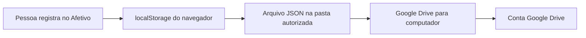

# Afetivo

Diário pessoal, local e privado para acompanhar humor, emoções, ativação,
contexto, sono, impulsos, atividade física, apoios percebidos e itens de rotina.

O Afetivo foi adaptado para reduzir o esforço de registro por pessoas com TDAH,
sem transformar o diário em tratamento, instrumento diagnóstico ou obrigação de
preenchimento diário. O núcleo do registro começa com duas perguntas opcionais:
como o momento foi percebido — de desagradável a agradável — e quanta ativação
estava presente.

> **Estado atual:** aplicação estática e local-first, sem backend, banco de dados,
> Gemini ou outra IA externa. Os dados permanecem no navegador e podem ser
> copiados para uma pasta sincronizada pelo Google Drive para computador.

## Sumário

- [Objetivos do projeto](#objetivos-do-projeto)
- [Principais recursos](#principais-recursos)
- [Adaptação para TDAH](#adaptação-para-tdah)
- [Privacidade e fluxo dos dados](#privacidade-e-fluxo-dos-dados)
- [Tecnologias](#tecnologias)
- [Executar localmente](#executar-localmente)
- [Testes](#testes)
- [Backup pelo Google Drive](#backup-pelo-google-drive)
- [Exportação e restauração](#exportação-e-restauração)
- [Arquitetura](#arquitetura)
- [Integração futura com IA](#integração-futura-com-ia)
- [Deploy](#deploy)
- [Compatibilidade](#compatibilidade)
- [Limitações conhecidas](#limitações-conhecidas)
- [Documentação complementar](#documentação-complementar)
- [Aviso importante](#aviso-importante)

## Objetivos do projeto

O sistema foi construído para:

- permitir registros rápidos ou detalhados, conforme a disponibilidade da pessoa;
- acompanhar mudanças ao longo do tempo sem exigir uma sequência diária;
- distinguir humor agradável/desagradável de ativação baixa/alta;
- separar um registro do momento de um resumo do dia;
- manter respostas ausentes como desconhecidas, sem convertê-las em zero;
- conservar múltiplos registros feitos no mesmo dia;
- apresentar contagens e descrições sem inferir causa, diagnóstico ou prognóstico;
- facilitar a geração de um resumo que a pessoa possa guardar ou compartilhar;
- preservar os dados sem exigir conta, servidor próprio ou assinatura paga.

## Principais recursos

| Área          | Recursos                                                         |
| ------------- | ---------------------------------------------------------------- |
| Registro      | Humor, ativação, data, horário e tipo de registro                |
| Contexto      | Emoções, situações relatadas e notas livres                      |
| Bem-estar     | Sono, energia física, ansiedade e irritabilidade                 |
| Foco          | Clareza mental, hiperfoco e atividade pretendida não concluída   |
| Impulsos      | Ocorrência, intensidade, desfecho e estratégia escolhida         |
| Atividade     | Tipo, duração e intensidade de atividade física                  |
| Apoios        | Apoio percebido, avaliação subjetiva e próximo passo             |
| Rotina        | Cadastro de medicamentos, suplementos ou outros itens de rotina  |
| Histórico     | Busca, filtros, edição e exclusão com confirmação interna        |
| Visualização  | Gráfico por período e escalas antigas preservadas separadamente  |
| Análise       | Cobertura dos registros, contextos frequentes e apoios avaliados |
| Relatório     | Texto local por período, cópia, download e impressão/PDF         |
| Portabilidade | Exportação JSON completa e CSV para planilhas                    |
| Backup        | Cópias versionadas em pasta sincronizada pelo Google Drive       |

Os dados demonstrativos são identificados como fictícios e ficam fora das
análises e dos relatórios pessoais.

### Registro rápido e rascunho local

O novo registro começa apenas com humor, ativação, data e horário. As demais
seções aparecem somente ao escolher **Adicionar mais detalhes**. Nenhuma
resposta é obrigatória.

Os campos de foco ficam em **Adicionar mais detalhes → Foco e clareza**. A
seção é recolhida por padrão e diferencia “não”, “sim” e “não informado”.
Clareza mental usa uma escala descritiva de 1 (muito nebulosa) a 5 (muito
clara). Descrição do hiperfoco e atividade pretendida não concluída são textos
curtos opcionais; ausência permanece `null`.

Enquanto um novo registro está aberto, alterações são guardadas localmente na
chave `afetivo_entry_draft_v1`, após uma breve pausa. Fechar o modal preserva o
rascunho, inclusive quando isso acontece antes dessa pausa. Ao abrir **Novo
Registro** novamente, o conteúdo e o modo rápido/detalhado são restaurados.

O rascunho é removido depois de salvar o registro, ao escolher **Descartar
rascunho**, ao limpar todos os dados ou ao restaurar a demonstração. Edições de
registros existentes não usam nem substituem esse rascunho.
O rascunho não é enviado para serviços externos nem incluído nos backups antes
de virar um registro salvo.

### Instalação como aplicativo (PWA)

O Afetivo pode ser instalado na tela inicial sem loja de aplicativos. A PWA usa
um manifesto próprio e um service worker que guarda somente a interface e os
assets estáticos da mesma origem. Registros, rascunhos e preferências continuam
no armazenamento local do navegador e não são enviados pelo service worker.

Para testar localmente em modo de produção:

```bash
npm run build
npm start
```

Abra `http://localhost:4173`, aguarde o primeiro carregamento e verifique:

1. Chrome ou Edge: use o ícone de instalação na barra de endereço ou
   **Menu → Instalar Afetivo**.
2. Android: use **Adicionar à tela inicial** no menu do navegador.
3. iPhone/iPad: no Safari, use **Compartilhar → Adicionar à Tela de Início**.
4. No DevTools, abra **Application → Manifest** para conferir nome, cores e
   ícones, e **Application → Service Workers** para conferir o worker ativo.
5. Após uma visita online, marque **Offline** no DevTools e recarregue. A
   interface deve abrir; os dados locais permanecem disponíveis.

A instalação exige HTTPS no endereço publicado. `localhost` é aceito pelos
navegadores durante o desenvolvimento.

### Preferência de lembretes

O perfil local possui uma preferência opcional com a seguinte linguagem:

> Quero usar lembretes leves quando estiverem disponíveis.

> Por enquanto, isso apenas guarda sua preferência neste dispositivo. O
> Afetivo ainda não solicita permissão nem envia notificações.

Essa opção não chama a Notification API. O ponto futuro de integração está
comentado no componente de preferências e no service worker, incluindo a regra
de solicitar permissão somente após uma ação explícita.

## Adaptação para TDAH

A adaptação se concentra na experiência de registro, não no tratamento do TDAH.
As principais decisões de interface são:

- duas perguntas iniciais curtas;
- alvos de toque de pelo menos 44 × 44 px no registro rápido;
- indicação “Pronto para salvar” sem exigir respostas;
- detalhes organizados em seções opcionais;
- possibilidade de salvar sem preencher todos os campos;
- ausência de valores clínicos presumidos;
- suporte a vários momentos no mesmo dia;
- textos sem julgamento de sucesso ou fracasso;
- distinção entre pergunta pulada e resposta explícita como “não percebi”;
- demonstração separada dos dados pessoais;
- resumos descritivos, sem índices artificiais de estabilidade;
- ausência de metas obrigatórias, sequências ou punições por dias não registrados.

As decisões e suas referências estão documentadas em
[docs/PESQUISA_TDAH_DIARIO_HUMOR.md](docs/PESQUISA_TDAH_DIARIO_HUMOR.md).
A pesquisa é narrativa e direcionada; não constitui validação clínica da
interface nem revisão sistemática própria.

## Privacidade e fluxo dos dados

O Afetivo não possui conta de usuário, banco de dados remoto ou API de análise.
O diário principal é armazenado no `localStorage` do navegador correspondente
ao domínio em que a aplicação foi aberta.



Pontos importantes:

- publicar o site não envia automaticamente o diário para a hospedagem;
- trocar de navegador, computador ou domínio cria outro armazenamento local;
- o navegador exige autorização explícita para acessar uma pasta;
- o Afetivo recebe um identificador da pasta, não a senha da conta Google;
- os arquivos JSON não possuem criptografia própria;
- a pasta deve permanecer privada se contiver informações sensíveis;
- o Drive para computador, e não o Afetivo, realiza o upload para a nuvem.

## Tecnologias

- React 19;
- TypeScript;
- Vite 8;
- Tailwind CSS 4;
- Lucide React;
- Motion;
- Playwright para testes de navegador;
- Node Test Runner para testes de serviços e regras de dados;
- File System Access API e IndexedDB para autorização da pasta de backup.

A aplicação gerada é um conjunto de arquivos estáticos. Não é necessário manter
um processo Node em produção quando a plataforma oferece hospedagem estática.

## Executar localmente

### Requisitos

- Node.js `24.19.0`, versão usada na validação; ou uma versão compatível com
  Vite 8, como Node `22.12` ou superior;
- npm;
- Chrome ou Edge para testar a seleção de pastas;
- Chromium ou navegador instalado pelo Playwright para a suíte de interface.

### Instalação

```bash
git clone https://github.com/guilhermemlp/afetivo.git
cd afetivo
npm ci
```

### Desenvolvimento

```bash
npm run dev
```

O Vite mostrará o endereço local no terminal.

### Build de produção

```bash
npm run build
```

Os arquivos finais serão criados em `dist/`.

### Conferir o build localmente

```bash
npm start
```

`npm start` executa o preview do Vite. Em hospedagem, publique diretamente a
pasta `dist`.

### Scripts disponíveis

| Comando                | Finalidade                                                     |
| ---------------------- | -------------------------------------------------------------- |
| `npm run dev`          | Inicia o servidor de desenvolvimento                           |
| `npm run build`        | Gera o site estático em `dist/`                                |
| `npm start`            | Abre o build em modo preview                                   |
| `npm run preview`      | Alias direto do preview do Vite                                |
| `npm run lint`         | Executa a verificação do TypeScript sem gerar arquivos         |
| `npm test`             | Executa testes de serviços, armazenamento, relatórios e backup |
| `npm run test:browser` | Executa os fluxos de navegador com Playwright                  |
| `npm run clean`        | Remove a pasta `dist/`                                         |

## Testes

Execute a validação completa com:

```bash
npm run lint
npm test
npm run build
npm run test:browser
```

Na validação de 6 de outubro de 2026 foram aprovados:

- 31 testes de regras de dados, relatórios, armazenamento, backup e contrato de
  provedor;
- 21 testes completos de navegador;
- build de produção;
- verificação TypeScript;
- inspeção exploratória em larguras de 320, 390, 768 e 1440 pixels;
- auditoria básica de nomes acessíveis dos controles visíveis;
- execução sem erros de console, exceções, requisições externas ou respostas
  HTTP de erro.

A suíte de navegador cobre, entre outros fluxos:

- exclusão de medicamento com cancelar, confirmar e recarregar;
- confirmação interna em páginas incorporadas que bloqueiam `window.confirm`;
- criação, edição e exclusão de registros;
- múltiplos momentos no mesmo dia;
- campos opcionais e respostas ausentes;
- falha simulada do armazenamento;
- relatórios, impressão e falha da área de transferência;
- importação de backup válido e rejeição de conteúdo inválido;
- criação automática, restauração e revogação da pasta de backup;
- navegação móvel, teclado, Escape e restauração de foco;
- garantia de que a análise permanece local.

Se não houver Chromium no sistema:

```bash
npx playwright install chromium
```

Também é possível indicar um executável já instalado:

```bash
CHROMIUM_EXECUTABLE_PATH=/caminho/para/chromium npm run test:browser
```

## Backup pelo Google Drive

Esta integração não utiliza Google Cloud, OAuth, Google Drive API ou chave de
acesso. Ela depende do aplicativo oficial Google Drive para computador.

### Preparação

1. Instale o [Google Drive para computador](https://www.google.com/drive/download/).
2. Conecte sua conta Google.
3. Crie uma pasta chamada `Afetivo` dentro do Drive.
4. Abra o Afetivo no Chrome ou Edge por HTTPS ou `localhost`.
5. Acesse **Backup & Exportar**.
6. Clique em **Escolher pasta do Drive**.
7. Selecione a pasta desejada e autorize o acesso.

Exemplo no Windows:

```text
I:\Meu Drive\Afetivo
```

O caminho não deve ser colocado em `.env`, no Render ou no código. O seletor do
navegador é obrigatório por segurança.

### Funcionamento automático

Ao conectar a pasta, a opção **Criar backup ao salvar registros** é ativada.
Depois disso, cada clique em **Salvar** cria imediatamente um novo arquivo
JSON completo. O painel de backup pode estar fechado.

Cada arquivo possui nome único e as versões anteriores são preservadas. O
Afetivo mostra até as dez cópias mais recentes, mas não apaga automaticamente
as demais. A limpeza pode ser feita manualmente pelo Drive.

O aplicativo confirma a gravação local do arquivo, mas não consegue confirmar
que o upload do Google terminou. Consulte o ícone do Drive para verificar o
estado da sincronização.

Detalhes e procedimentos de recuperação estão em
[docs/BACKUP_PASTA_DRIVE.md](docs/BACKUP_PASTA_DRIVE.md).

## Exportação e restauração

### JSON

O backup JSON completo contém:

- registros pessoais e demonstrativos;
- itens de rotina;
- perfil local;
- versão do formato;
- data de exportação.

A importação valida o arquivo antes de substituir os dados. Conteúdo inválido,
datas impossíveis, identificadores duplicados e estruturas incorretas são
rejeitados. A substituição exige confirmação dentro da aplicação.

### CSV

O CSV é destinado a planilhas e inclui os campos relevantes dos registros. Os
textos são escapados e valores iniciados como fórmulas são neutralizados para
reduzir o risco de execução ao abrir o arquivo em uma planilha.
Clareza mental, presença de hiperfoco, descrição curta e atividade pretendida
não concluída possuem colunas próprias; respostas ausentes ficam vazias.

### Recuperação em outro computador

1. Espere o Google Drive para computador sincronizar a pasta.
2. Abra o Afetivo no novo computador.
3. Autorize a mesma pasta em **Backup & Exportar**.
4. Escolha uma cópia em **Restaurar uma cópia da pasta**.

No celular, baixe o JSON pelo aplicativo do Drive e use a importação manual. O
sistema não mescla automaticamente diários alterados em dois dispositivos.

## Arquitetura

```text
afetivo/
├── docs/                         Pesquisa, revisão e guias técnicos
├── public/                       Arquivos estáticos, incluindo favicon
├── src/
│   ├── components/               Interface e provedores React
│   ├── hooks/                    Comportamento compartilhado de interface
│   ├── services/
│   │   ├── analysisProvider.ts   Contrato neutro de análise e modo local
│   │   ├── dates.ts              Datas de calendário local
│   │   ├── folderBackup.ts       Leitura e escrita segura na pasta
│   │   ├── observations.ts       Resumos descritivos e relatórios
│   │   ├── storage.ts            Persistência, migração e exportação
│   │   └── validation.ts         Validação de dados e backups
│   ├── types/                    Modelo de dados do diário
│   ├── App.tsx                   Navegação e estado principal
│   └── main.tsx                  Inicialização dos provedores React
├── tests/                        Testes unitários e de navegador
├── index.html                    Documento HTML principal
├── package.json                  Scripts e dependências
└── vite.config.ts                Configuração do Vite
```

### Armazenamento local

As chaves atuais são:

```text
afetivo_entries_v2
afetivo_medications_v2
afetivo_user_profile_v2
```

Há migração controlada de formatos anteriores. Os dados são validados antes da
persistência e da restauração.

### Separação de responsabilidades

- componentes não acessam serviços externos de IA;
- `storage.ts` controla a persistência local e os formatos de exportação;
- `validation.ts` protege importações e migrações;
- `observations.ts` produz descrições determinísticas;
- `folderBackup.ts` limita nomes, tamanhos e tipos de arquivo;
- `FolderBackupProvider` reage às alterações e agenda a cópia automática;
- `ConfirmationProvider` substitui diálogos nativos bloqueáveis.

## Integração futura com IA

Nenhum provedor externo está ativo. A análise atual é determinística, acontece
no navegador e não precisa de chave.

O contrato `PatternAnalysisProvider`, em
`src/services/analysisProvider.ts`, permite acrescentar futuramente OpenAI,
Anthropic, Gemini, um modelo local ou outro serviço sem alterar o formato dos
registros.

Uma integração externa deve:

1. executar em backend ou função serverless confiável;
2. manter a chave fora do bundle do navegador;
3. exigir uma ação explícita da pessoa;
4. informar quais dados serão enviados;
5. validar entrada e resposta;
6. utilizar autenticação, limite de uso e timeout;
7. preservar a análise local como fallback;
8. não gerar diagnóstico, prognóstico ou orientação de medicação.

Nunca coloque chaves secretas em variáveis `VITE_*`, pois elas são incorporadas
ao JavaScript entregue ao navegador.

Veja [docs/PROVEDOR_IA.md](docs/PROVEDOR_IA.md).

## Deploy

O projeto deve ser publicado como site estático.

### Render

No painel do Render, crie um **Static Site** e use:

| Campo             | Valor                     |
| ----------------- | ------------------------- |
| Repositório       | `guilhermemlp/afetivo`    |
| Branch            | `main`                    |
| Root Directory    | vazio                     |
| Build Command     | `npm ci && npm run build` |
| Publish Directory | `dist`                    |
| Auto-Deploy       | habilitado                |
| `NODE_VERSION`    | `24.19.0`                 |

Como rewrite para SPA, pode ser configurado:

| Source | Destination   | Action  |
| ------ | ------------- | ------- |
| `/*`   | `/index.html` | Rewrite |

Não configure Gemini, banco de dados, Google Cloud ou o caminho da pasta do
Drive no Render.

### Vercel

A Vercel normalmente reconhece o Vite automaticamente. Se for necessário
preencher manualmente:

| Campo            | Valor           |
| ---------------- | --------------- |
| Framework        | Vite            |
| Build Command    | `npm run build` |
| Output Directory | `dist`          |
| Install Command  | `npm ci`        |

### Cloudflare Pages

| Campo                  | Valor           |
| ---------------------- | --------------- |
| Production branch      | `main`          |
| Build Command          | `npm run build` |
| Build output directory | `dist`          |

### Depois de publicar

1. Abra a URL estável no Chrome ou Edge.
2. Crie um registro e recarregue a página.
3. Confira o relatório e as exportações.
4. Autorize novamente a pasta sincronizada do Drive.
5. Salve um registro e verifique o JSON na pasta e no site do Google Drive.

O `localStorage` e a autorização da pasta são vinculados ao domínio. Migrar do
subdomínio da hospedagem para um domínio próprio exige novo acesso à pasta e,
se necessário, restauração de um backup JSON.

## Compatibilidade

| Ambiente                     | Situação                                                            |
| ---------------------------- | ------------------------------------------------------------------- |
| Chrome/Edge desktop em HTTPS | Fluxo completo, incluindo pasta sincronizada                        |
| Chrome/Edge em `localhost`   | Fluxo completo para desenvolvimento                                 |
| Firefox/Safari               | Diário e downloads; seleção persistente de pasta pode não funcionar |
| Navegadores móveis           | Diário e importação/download; seleção de pasta é limitada           |
| Página HTTP pública          | Seleção de pasta pode ser bloqueada; use HTTPS                      |
| Iframe com sandbox           | Confirmações internas funcionam sem `allow-modals`                  |

Todas as plataformas recomendadas de deploy fornecem HTTPS no subdomínio
padrão.

## Limitações conhecidas

- não existe sincronização automática ou mesclagem entre dispositivos;
- a pasta do Drive funciona como backup versionado, não como banco de dados;
- arquivos JSON não possuem senha ou criptografia própria;
- backups antigos não são apagados automaticamente;
- o suporte à File System Access API varia por navegador;
- não há lembretes, notificações ou salvamento de rascunho;
- os campos não formam uma escala clínica validada;
- não são calculadas relações causais, evolução clínica ou eficácia terapêutica;
- itens configurados como duas vezes ao dia possuem um status agregado por
  registro, não controle separado de cada dose;
- não há IA externa ativa;
- ainda são necessários testes de usabilidade com pessoas com TDAH.

## Documentação complementar

- [Pesquisa sobre TDAH, emoções e diário de humor](docs/PESQUISA_TDAH_DIARIO_HUMOR.md)
- [Registro estruturado das buscas científicas](docs/BUSCAS_TDAH_2026-10-06.json)
- [Revisão funcional e falhas corrigidas](docs/REVISAO.md)
- [Backup em pasta do Google Drive](docs/BACKUP_PASTA_DRIVE.md)
- [Contrato para provedores futuros de IA](docs/PROVEDOR_IA.md)

## Aviso importante

O Afetivo é uma ferramenta pessoal de autorregistro. Ele não substitui avaliação
profissional, diagnóstico, tratamento, orientação de medicação ou atendimento
de emergência. Os relatórios descrevem somente o que foi informado e devem ser
interpretados considerando lacunas, contexto e limitações do autorrelato.

Em uma situação de risco imediato ou emergência, procure os serviços de
emergência da sua região ou uma pessoa de confiança. Não dependa deste
aplicativo para intervenção em crise.
